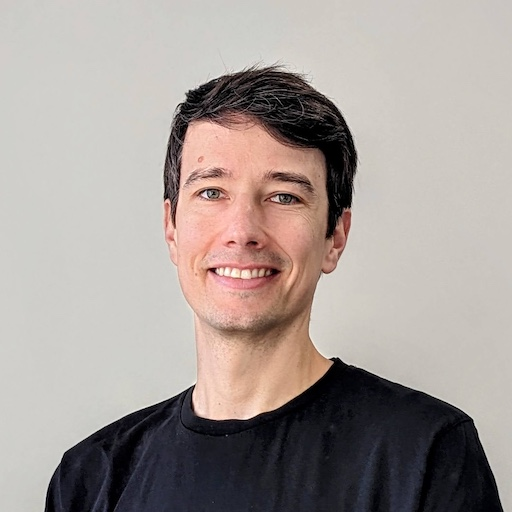

# René Wilby public speaking

Helping other people to achieve their goals is a great motivation for me. This is a lot about sharing knowledge and educating. Whether through blog posts, active participation in communities or as a university lecturer and trainer. I want to continue this passion by giving talks at meetups, user groups and conferences.

## Want to collaborate or invite me to your event?

If you're interested in collaborating on content or having me speak at your event, please to reach out to me on GitHub, Bluesky, or LinkedIn.

## Social media

- [LinkedIn](https://www.linkedin.com/in/rene-wilby)
- [Bluesky](https://bsky.app/profile/rene-wilby.de)

## Current talks

- [Bridging the Gap: Seamless and type-safe communication between Spring Boot and React](abstracts/bridging-the-gap.md)
- [A journey towards end-to-end observability for Single Page Applications](abstracts/journey-towards-e2e-observability-spa.md)

## Bio

René Wilby is a seasoned freelance software engineer specializing in development of full-stack web apps, microservices, APIs, and DevOps. René also has extensive experience as a university lecturer, trainer and speaker.

## Picture

## Online content

I write about things I do and I'm interested in on my [blog](https://rene-wilby.de/en/blog/).

## Speaking engagements

| Date | Event | Location |
| - | - | - |
| 2025-07-28 | [GFU Cyrus AG Semicolon](https://www.gfu.net/seminare-schulungen-kurse/semicolon_sk73/spring_boot_react_integrieren_s5162.html) | Online |
| 2025-06-11 | [DevTalk@TK](https://www.meetup.com/de-DE/devtalk-tk) | Hamburg, Germany |
| 2025-04-02 | [JavaLand Conference](https://my.doag.org/events/javaland/2025/agenda/#agendaId.5229) | Nürburgring, Germany |
| 2025-03-25 | [FLX Engineering Days](https://fastleansmart.com/) | Heikendorf, Germany |
| 2025-03-19 | [JUG Hamburg](https://www.meetup.com/de-DE/jug-hamburg/events/306459656) | Hamburg, Germany |
| 2025-01-16 | [Kiel React (Native) Meetup](https://www.meetup.com/de-DE/kiel-react-native-meetup/events/305442775) | Kiel, Germany |
| 2024-10-29 | [Vaadin Create](https://vaadin.com/vaadin-create) | Frankfurt, Germany |

## Recordings

| Date | Event | Link |
| - | - | - |
| 2024-10-29 | [Vaadin Create](https://vaadin.com/vaadin-create) | [YouTube](https://youtu.be/zNV0gHk-GIA) |
